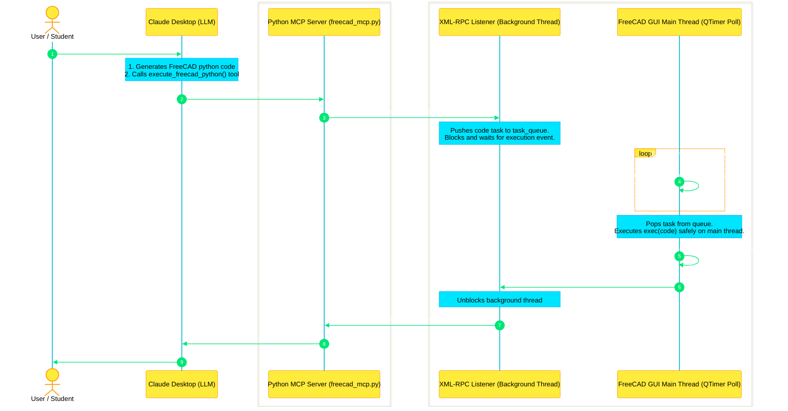
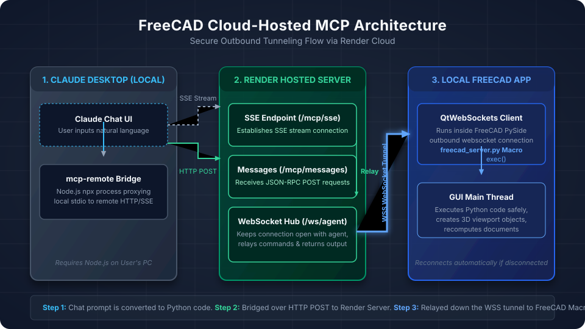
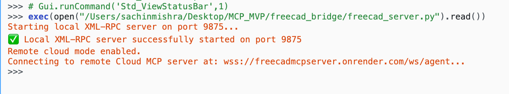
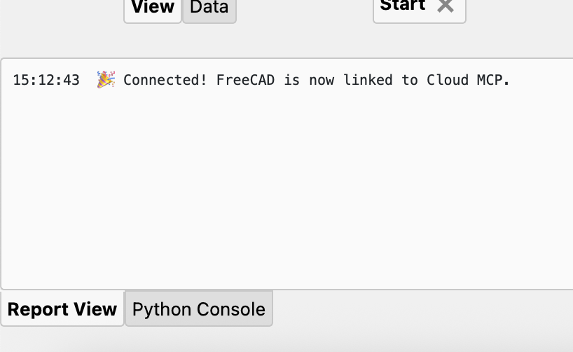

# FreeCAD MCP Server 🛠️📐

Connect your local **FreeCAD** instance directly to Claude Desktop! Build, inspect, and verify 3D geometry in real-time using natural language commands, powered by our cloud-hosted MCP Server.

---

## 🌟 Key Features

* **AI-Driven 3D Modeling:** Translate conversational prompts into complex FreeCAD Python API operations automatically.
* **Zero Local Dependencies:** No need to install `pip` packages, virtual environments, or run local Python terminals. FreeCAD's built-in Qt event loop manages the WebSocket connection natively.
* **Active Viewport Inspection:** Fetch object hierarchies and properties to maintain state context.
* **Visual Verification:** Supports taking screenshots of the active 3D view and encoding them in base64, enabling vision-capable models to verify modeling progress.

---

## 🗺️ System Architecture Diagrams

### 1. System Architecture Flow
Below is the sequence diagram illustrating how Python commands execute safely on FreeCAD's GUI main thread via the bridge listener:



### 2. Cloud-Hosted Topology
Below is the network topology showing the remote hosted Render WebSocket tunnel connection:



---

## 🚀 Quick Start Guide

> [!IMPORTANT]
> To use this setup, you must have **Node.js** installed on your system (required by Claude Desktop to bridge to the remote server).

### Step 1: Clone this Repository
Clone this repository to your local machine to access the connection macro script:
```bash
git clone https://github.com/<your-username>/FreeCADMCPServer.git
cd FreeCADMCPServer
```

### Step 2: Start the Connection inside FreeCAD
1. Launch **FreeCAD**.
2. Open the **Python console** panel:
   * Go to **View** $\rightarrow$ **Panels** $\rightarrow$ check **Python console**.
3. Run this single command to load and start the bridge (replace `<absolute-path-to-repo>` with the actual path where you cloned this repository):
   ```python
   exec(open("<absolute-path-to-repo>/freecad_bridge/freecad_server.py").read())
   ```
4. Verify the output in the console:  
   `Connecting to remote Cloud MCP server at: wss://freecadmcpserver.onrender.com/ws/agent...`
   `🎉 Connected! FreeCAD is now linked to Cloud MCP.`



---




> [TIP]
> **One-Click Macro Setup:** You can add this folder as your macro directory in FreeCAD under **Tools** $\rightarrow$ **Macro** $\rightarrow$ **Macros...** and set the path. The script `freecad_server.py` will appear as a runnable macro!

### Step 3: Configure Claude Desktop
Add the remote server configuration to your `claude_desktop_config.json` (located at `~/Library/Application Support/Claude/claude_desktop_config.json` on macOS, or `%APPDATA%\Claude\claude_desktop_config.json` on Windows):

```json
{
  "mcpServers": {
    "freecad-remote": {
      "command": "npx",
      "args": [
        "-y",
        "mcp-remote",
        "https://freecadmcpserver.onrender.com/mcp/sse"
      ]
    }
  }
}
```
*Note: Fully restart (Quit and Reopen) your Claude Desktop app after saving the configuration.*

---

## 💬 Prompts to Try in Claude

Once connected, you can chat with Claude to build 3D parts:
* *"Create a new document called 'Table' and build a 1200x800mm table top sitting on 4 legs."*
* *"List the objects currently present in the active scene."*
* *"Take a screenshot of the 3D viewport so I can see what is built."*

---

## 🔒 Security & Privacy Notice
All communications between your local FreeCAD instance and our cloud server are encrypted over standard secure protocols (`wss://` and `https://`). The remote server only facilitates the message passing to your active local agent, meaning your local environment remains isolated and secure.

---

## ✍️ Authors & Credits
Created with ❤️ using **Python** and **FastMCP**.

* **Author:** Sachin Mishra
* **Email:** [sachin19566@gmail.com](mailto:sachin19566@gmail.com)
