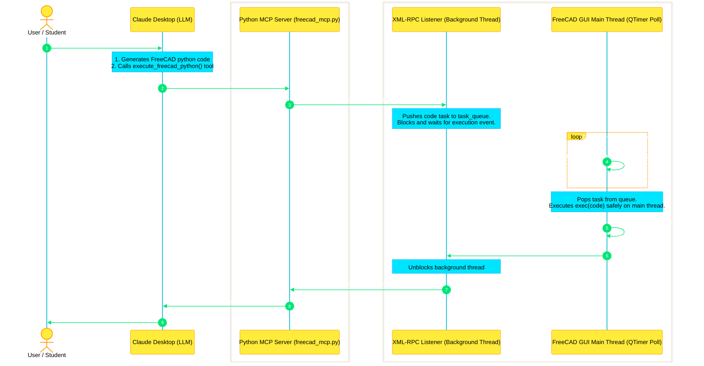

# FreeCAD MCP Server 🛠️📐

An open-source Model Context Protocol (MCP) server that connects Large Language Models (like Claude) directly to **FreeCAD**. Build, inspect, and verify 3D geometry in real-time using natural language commands.

---

## 🌟 Key Features

* **AI-Driven 3D Modeling:** Translate conversational prompts into complex FreeCAD Python API operations automatically.
* **Qt-Safe Execution Bridge:** Uses a custom background XML-RPC server and `QTimer` queue polling to run geometry updates safely on FreeCAD's main GUI thread without crashing the application.
* **Scene Inspector:** Allows Claude to fetch the hierarchy and properties of active document objects to maintain state context.
* **Viewport Verification:** Supports capturing screenshots of the active 3D view and encoding them in base64, enabling vision-capable AI models to verify modeling progress.

---

## 📂 Project Directory Structure

```text
MCP_MVP/
├── freecad_bridge/
│   └── freecad_server.py    # XML-RPC receiver & scheduler (runs inside FreeCAD)
├── server/
│   ├── __init__.py
│   └── freecad_mcp.py       # Standalone FastMCP server process (runs in terminal)
├── test_freecad_rpc.py      # Connection validator client
├── architecture_guide.md    # Detailed execution flow and pedagogical guide
├── requirements.txt         # Project package dependencies
└── README.md                # Project documentation
```

For a detailed explanation of the internal threading model and sequence diagrams, refer to the **[architecture_guide.md](architecture_guide.md)**.

---

## 🗺️ System Architecture Flow



---

## 🔌 How XML-RPC Communication Works under the Hood

To keep FreeCAD stable and responsive, this project divides the execution of modeling code using an **XML-RPC Client-Server Bridge**. 

### What is XML-RPC?
* **RPC (Remote Procedure Call):** A programming concept that allows one program to invoke a function running in a completely different process or environment as if it were a local function.
* **XML-RPC:** A lightweight protocol that encodes function calls and return parameters into **XML** format and transmits them using standard **HTTP POST** requests.

### The Data Flow

1. **The Client (Terminal MCP Server):**  
   When Claude decides to create or modify geometry, the terminal process (`freecad_mcp.py`) utilizes Python's built-in client proxy to make a remote call:
   ```python
   client = xmlrpc.client.ServerProxy("http://127.0.0.1:9875")
   result = client.execute("import Part; Part.makeBox(10, 10, 10)")
   ```
   Behind the scenes, this gets serialized into an XML envelope and sent over HTTP:
   ```xml
   <methodCall>
     <methodName>execute</methodName>
     <params>
       <param><value><string>import Part; Part.makeBox(10, 10, 10)</string></value></param>
     </params>
   </methodCall>
   ```

2. **The Server (FreeCAD App Process):**  
   Inside FreeCAD, a `SimpleXMLRPCServer` runs on a background daemon thread listening on port `9875`. When the HTTP POST arrives, the server parses the XML envelope to extract the function name (`execute`) and the python code string.

3. **Thread-Safe Queueing & Execution:**  
   Because GUI manipulations must happen on Qt's main thread, the background thread pushes the script into a thread-safe queue and blocks on a `threading.Event`. FreeCAD's main thread GUI loop polls this queue every 50ms using a `QTimer`, executes the code block safely on the main thread, redirects and captures `stdout`/`stderr` logs, and triggers the synchronization event.

4. **Return Path:**  
   The background XML-RPC server thread unblocks, serializes the output dictionary into an XML response envelope, and returns it as an HTTP response to the MCP server.

---

## 🚀 Quick Start Guide

### Step 1: Install Dependencies
This project uses the official Model Context Protocol Python SDK. Install the requirements inside your virtual environment using `uv` or `pip`:
```bash
uv add mcp
```

### Step 2: Run the Bridge inside FreeCAD
1. Start the **FreeCAD** application.
2. Open the **Python console** panel:
   * **View** -> **Panels** -> check **Python console**
3. Load and execute the bridge server by running this command in the console:
   ```python
   exec(open("/Users/sachinmishra/Desktop/MCP_MVP/freecad_bridge/freecad_server.py").read())
   ```
4. Verify the output displays:  
   `FreeCAD Remote RPC server successfully started on port 9875`

### Step 3: Test the Bridge Connection
Run the validator script in your terminal to ensure the external process can communicate with FreeCAD:
```bash
python3 test_freecad_rpc.py
```
If successful, you will see `🎉 Connection test successful!` and a print confirmation inside FreeCAD.

### Step 4: Configure Claude Desktop
Add the server config to your `claude_desktop_config.json` (located at `~/Library/Application Support/Claude/claude_desktop_config.json` on macOS):

```json
{
  "mcpServers": {
    "freecad": {
      "command": "python3",
      "args": [
        "/Users/sachinmishra/Desktop/MCP_MVP/server/freecad_mcp.py"
      ]
    }
  }
}
```
*Note: Restart Claude Desktop after saving the configuration.*

---

## 🛠️ Testing Interactively (Optional)
You can run and test the tools inside a web browser using the official MCP Inspector utility:
```bash
npx -y @modelcontextprotocol/inspector uv run python3 server/freecad_mcp.py
```
Open `http://localhost:5173` to test the tools via a visual dashboard.

---

## 💬 Natural Language Prompts to Try

Connect your LLM and try prompting:
* *"Create a new document called 'Table' and build a 1200x800mm table top sitting on 4 legs."*
* *"List the objects currently present in the active scene."*
* *"Take a screenshot of the 3D viewport so I can see what is built."*

---

## ☁️ Running as a Remote / Cloud-Hosted Server (Horizon)

You can host this MCP server on the cloud using **Horizon (prefect.io)**, allowing you to connect Claude Desktop to your cloud URL while controlling your local FreeCAD application.

### Step 1: Deploy to Horizon
1. Push your local workspace directory to a **GitHub repository**.
2. Log into your **Horizon** dashboard, connect the repository, and deploy the service. 
3. Horizon will automatically detect `pyproject.toml`, install Python dependencies (FastAPI, websockets, mcp), and expose the SSE endpoints on a public URL (e.g. `https://your-mcp-app.horizon.prefect.io`).

### Step 2: Run the Local Agent on your Laptop
1. Open `freecad_bridge/local_agent.py` and replace `CLOUD_WS_URL` with your public Horizon WebSocket endpoint:
   ```python
   CLOUD_WS_URL = "wss://your-mcp-app.horizon.prefect.io/ws/agent"
   ```
2. Make sure FreeCAD is running and the internal bridge server is active (from Step 2 of the Quick Start Guide).
3. Start the agent in your terminal:
   ```bash
   uv run python3 freecad_bridge/local_agent.py
   ```
   *You will see the output: `🎉 Connected! Waiting for CAD commands from Cloud MCP...`*

### Step 3: Configure Claude Desktop
Configure your `claude_desktop_config.json` file to communicate with the cloud endpoints using **SSE Transport**:
```json
{
  "mcpServers": {
    "freecad-remote": {
      "transport": "sse",
      "url": "https://your-mcp-app.horizon.prefect.io/mcp/sse"
    }
  }
}
```
*Note: Restart Claude Desktop after saving the configuration.*

---

## 🔒 Security Notice
The XML-RPC bridge server is hardcoded to listen exclusively on localhost (`127.0.0.1`) for security. Never expose the XML-RPC server port (`9875`) to public networks, as it allows arbitrary Python code execution on your system.
