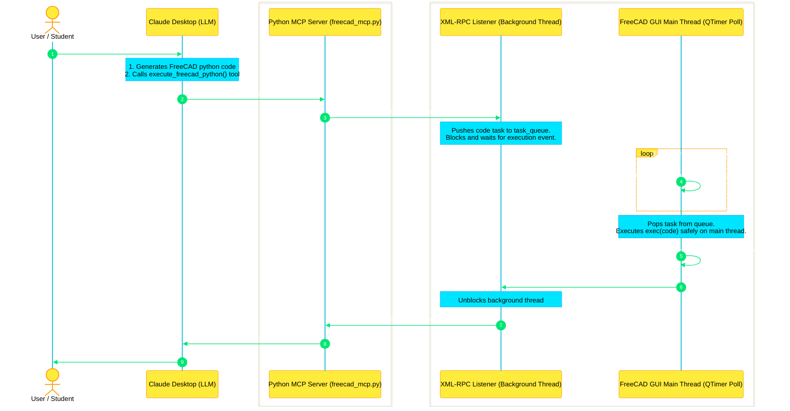

# Architecture & Pedagogical Guide: FreeCAD MCP Server

This guide explains how the FreeCAD MCP (Model Context Protocol) Server works. It is designed to help teachers explain the system architecture, thread safety, and execution flow to their students.

---

## 1. System Architecture Flow



---

## 2. The Core Problem: Why do we need a "Bridge"?

A key concept for students to learn is **GUI Thread Safety**:
* **The Rule of GUI Frameworks:** FreeCAD's GUI is built using **Qt** (via the `PySide6` or `PySide2` Python modules). In Qt, only the **Main GUI Thread** is allowed to manipulate 3D shapes, access document objects, or update viewport representations.
* **The Crash Scenario:** If we ran a standard network listener or an MCP server directly inside FreeCAD, incoming network requests would execute on background threads. If a background thread tries to edit FreeCAD shapes, FreeCAD will instantly crash with a segmentation fault.
* **The Solution:** We run the network receiver (XML-RPC server) in a background thread, but we **never** run the code on that thread. Instead, we place the commands in a thread-safe Queue and schedule them to be executed on the Main Thread via a `QTimer`.

---

## 3. Script-by-Script Breakdown

### A. The Internal Bridge (`freecad_bridge/freecad_server.py`)
This script runs inside FreeCAD's console and acts as the **receiver** and **scheduler**.

* **Background XML-RPC Server:** Starts a standard Python `SimpleXMLRPCServer` on local port `9875` running in a daemon background thread (`threading.Thread`). This prevents FreeCAD from freezing while waiting for network commands.
* **Task Queue (`task_queue`):** A thread-safe queue (`queue.Queue`) that passes commands from the background network thread to the main GUI thread.
* **Qt Timer (`poll_queue`):** A Qt timer (`QtCore.QTimer`) running on the main GUI thread that polls the queue every 50 milliseconds. When it finds a task, it pops and executes it safely.
* **Execution Capturing (`safe_execute`):** Redirects standard output and standard error into string buffers, executes the code using `exec()`, and returns any printed output or error messages to the caller.
* **Thread Synchronization (`threading.Event`):** Blocks the background RPC thread while the main thread executes the code, and unblocks it once the execution completes.

### B. The External MCP Server (`server/freecad_mcp.py`)
This script runs in the terminal and acts as the **adaptor** that connects Claude to FreeCAD.

* **FastMCP Server:** Integrates with the Model Context Protocol SDK to communicate with Claude using stdin/stdout.
* **Tools Exposed:**
  1. `execute_freecad_python(code)`: Sends Python commands generated by the LLM to FreeCAD's XML-RPC server and returns the console log.
  2. `get_document_objects()`: Queries the active document structure to give the LLM context on what objects are already in the 3D model.
  3. `capture_viewport_image()`: Triggers a screenshot of the current 3D view in FreeCAD and returns the image encoded in base64.

### C. The Test Client (`test_freecad_rpc.py`)
A standalone utility script that bypasses Claude and tests the XML-RPC server connection directly. It is used to verify that the bridge is functional before connecting the MCP server.

---

## 4. Execution Flow of a Command (e.g. "Draw a Cube")

1. **User input:** The student inputs *"Draw a 10mm cube"* in Claude.
2. **LLM Translation:** The AI translates the request into python code:
   ```python
   import Part
   doc = App.ActiveDocument or App.newDocument("Workspace")
   box = Part.makeBox(10, 10, 10)
   Part.show(box)
   doc.recompute()
   ```
3. **Tool Call:** Claude calls the `execute_freecad_python` tool.
4. **RPC Bridge:** The MCP server forwards this python code via XML-RPC.
5. **Safe Scheduling:** The bridge places the code in the queue. The Qt timer picks it up on FreeCAD's main thread and executes it.
6. **Execution Output:** The shape is rendered in FreeCAD, and any terminal output is returned to Claude.
7. **Complete:** Claude reads the success response and informs the student that the cube has been created.
